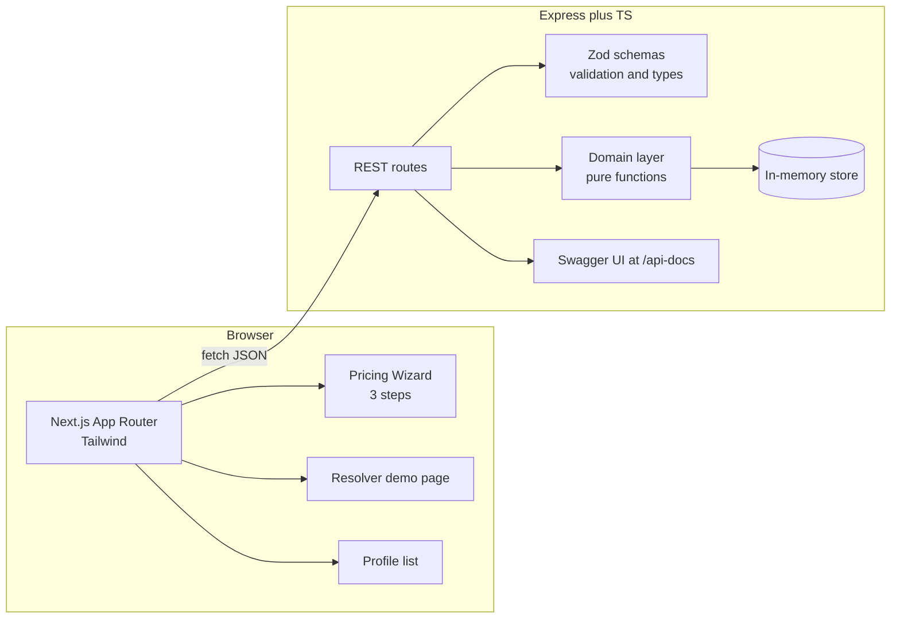
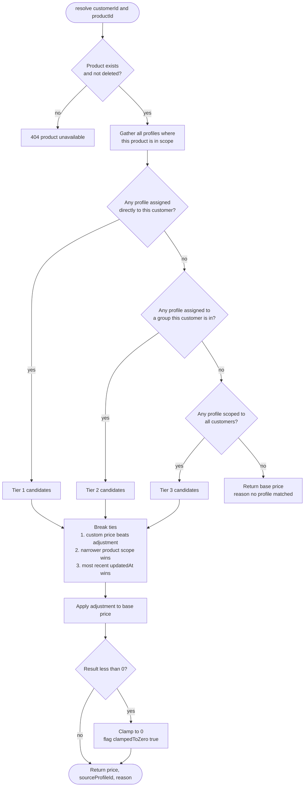
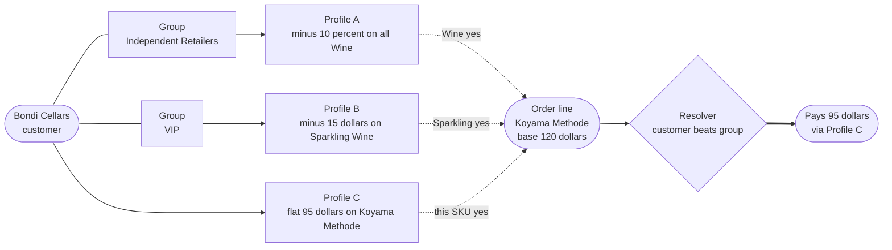
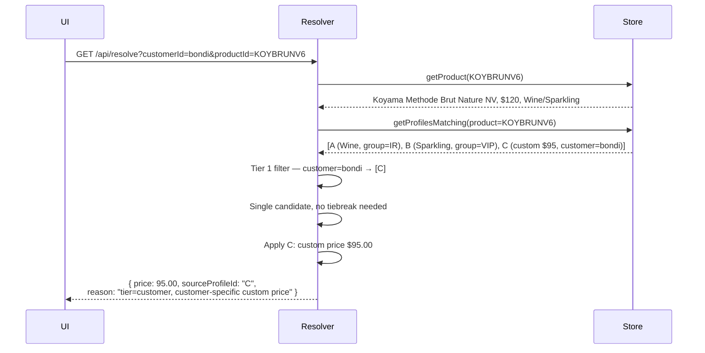
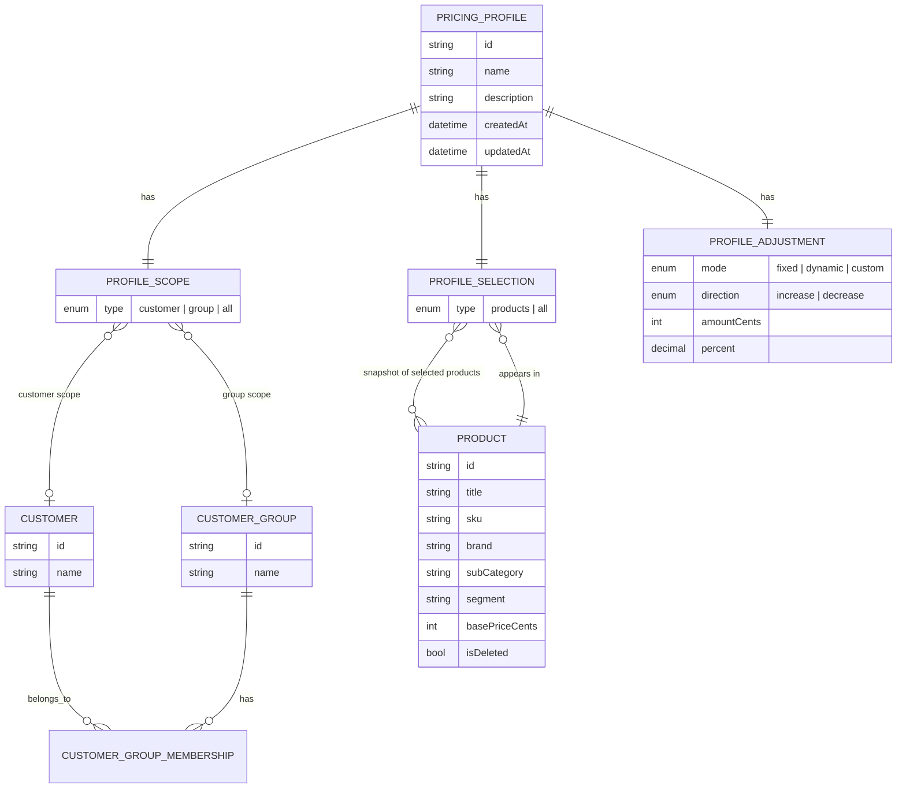
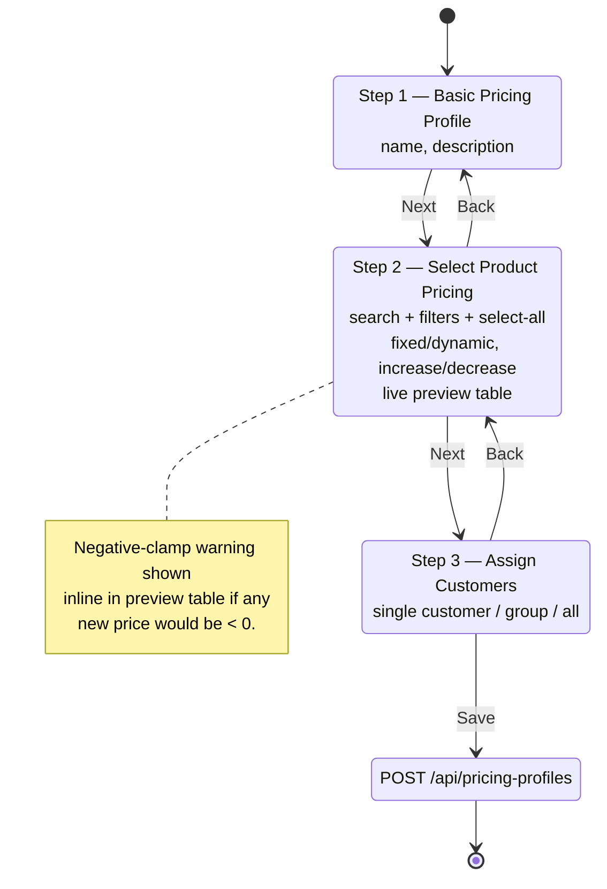

# FOBOH Pricing Challenge — Implementation Plan

## Context

FOBOH engineering challenge: a 3–4hr fullstack build for customer-specific pricing in F&B wholesale. The submission is judged less on whether the CRUD works (that's "the floor") and more on:

1. **The precedence rule** for overlapping pricing profiles — they explicitly call out that "AI will hand you a generic one; your rationale is what we're scoring."
2. **AI direction** — full conversation transcripts are required; they want to see where I pushed back vs. accepted.
3. **Judgement on small things** — rounding, negative prices, "all products" semantics, deleted products.

The headline scenario is Bondi Cellars (member of both "Independent Retailers" and "VIP" groups) ordering Koyama Methode Brut Nature NV, where three profiles match. The chosen rule must give a defensible, single answer.

Stack chosen by user: **TypeScript + Next.js frontend + Express backend, in `C:\Users\xps\Downloads\challenge`**, with the UI close to the design reference (teal sidebar nav, three-step wizard).

---

## Design observations — deliberately deferred

The Figma export shows a richer product surface than the brief asks for. Calling these out explicitly so the scoping decision is visible:

| Design element | Implies | In the brief? |
|---|---|---|
| *Save as Draft* + *Save & Publish Profile* | `status: 'draft' \| 'published'` and a resolver-side filter | ❌ |
| "expires in 16 Days" on summary card | `expiresAt` field and an expiry filter in the resolver | ❌ |
| "Marked as Default" badge | `isDefault` flag — likely equivalent to a Tier-3 (all-customers) fallback | ❌ |
| "Based on Price" dropdown | Adjustments can chain off other base prices (RRP, list, another profile's output) | ❌ |
| Collapsible 3-section wizard, per-section status indicators, *Make Changes* | UX polish | ❌ |
| One / Multiple / All Products radio | UI affordance over the existing selection model | △ ("select-all" is in the brief; the explicit three-way isn't) |

**None of these are in the brief's business logic.** The brief asks for search/filter, selection (incl. select-all), fixed/dynamic adjustment, preview, save, the calc rules, never-negative clamp, CRUD, Swagger, and the precedence resolver. The Figma represents the eventual production product; the brief is the MVP cut for the challenge.

Scoped down to the brief by choice. The deferred items are listed under [What I'd note in the README's "what next"](#what-id-note-in-the-readmes-what-next) so the upgrade path is documented. The brief explicitly warns *"AI will hand you a generic one. Your rationale is what we're scoring"* — accepting every detail in the design uncritically is the AI-driven over-build it warns against. Cutting these protects the resolver-quality budget, which is what's actually being scored.

---

## System overview



Frontend and backend are intentionally decoupled — no shared types package, no monorepo tooling. Each side declares the types it needs. Trade-off is explicit: types can drift, which we accept for now in exchange for independent build, deploy, and ownership. A shared package (or OpenAPI-generated client) is listed in *what's next* if/when a second consumer or a larger team makes drift expensive.

---

## The precedence rule (the headline decision)

**Rule: Most-specific-wins, no stacking.**

A customer ordering a product gets exactly one price from exactly one profile. Profiles are ranked by:

1. **Customer specificity** (highest wins)
   - Tier 1: Profile assigned to this specific customer
   - Tier 2: Profile assigned to a customer-group this customer is in
   - Tier 3: Profile assigned to "all customers"
2. **Price-set specificity** (tiebreaker within the same customer tier)
   - A fixed *custom price* ($X for this exact SKU) beats a *category adjustment* (% or $ off Wine)
   - A narrower product scope beats wider (specific SKU > sub-category > segment > brand > all products)
3. **Recency** (final tiebreaker)
   - Most recently `updatedAt` wins. Engineers and account managers can resolve a conflict by re-saving the profile they want to win.

**Bondi Cellars + Koyama Methode Brut Nature NV → $95** (Profile C wins on tier 1; A and B never get evaluated).

### Resolver decision flow



### Why three profiles match Bondi

Bondi Cellars is a member of *both* customer groups simultaneously (groups are tags, not exclusive buckets). When they order the Koyama Methode Brut Nature NV, three profiles independently qualify — one via each group membership, and one direct customer-level deal:



Three candidate prices come out: A gives $108, B gives $105, C gives $95. The resolver picks C because the customer-level scope (Tier 1) beats group-level scope (Tier 2) — A and B never get computed at runtime.

### Bondi scenario walkthrough



### Why this rule — grounded in industry precedent

I researched how real B2B pricing engines resolve overlapping rules. There's a clean split into four camps; the choice maps directly onto a platform's commercial posture.

| Pattern | Examples | Why they chose it |
|---|---|---|
| **Most-specific-wins (no stacking)** | SAP S/4HANA (access sequence + exclusive indicator), NetSuite (Item > Pricing Group > Customer), Odoo (contract → customer → tier → list), Wine Hub, inecta, 365WineTrade, Acctivate | ERP and account-managed B2B. Prices are negotiated commitments; suppliers own the relationship; customer trusts "the price is the price." |
| **Lowest-price-wins** | Shopify B2B (`MIN` across overlapping catalogs), Adobe Commerce / Magento (`Final = MIN(base, tier, special, rule)`) | Self-service B2B ecommerce. Customer has agency on the page, expects the platform to honor the best discount they qualify for; churn risk if they feel cheated. |
| **Explicit numeric priority** | Salesforce CPQ (Evaluation Order field), WooCommerce B2B | CPQ and configurable platforms. Won't opinionate; pushes responsibility to whoever authors the rules. Salesforce's own docs concede that if two rules collide, "there's no way to dictate which is used — best practice is to design so it can't happen." |
| **Configurable / multi-mode** | Shopware (toggle between "most specific first" / "individual first" / "higher wins") | Platforms serving multiple verticals at once. |
| **Stacking, deterministic order** | Stripe, Chargebee (fixed before percent, etc.) | Subscription billing with promotional layering — different commercial model. |

**Why most-specific-wins is the right choice *for FOBOH*:**

1. **FOBOH is supplier-facing, not buyer-facing.** From their site: AI agents for F&B wholesalers — order management, sales co-pilot, collections. The user paying FOBOH is the supplier. The product's job is supplier control and margin protection, which is exactly the ERP camp's posture. The design reference (Pricing Profile wizard) is a supplier tool, not a buyer storefront.
2. **F&B industry analogues land in the same camp.** Wine Hub, inecta (Wine Distribution), Acctivate, 365WineTrade — every wine/spirits/F&B specialist I could find treats contract and customer-specific prices as overrides, not as inputs to a min/max comparison.
3. **The McKinsey pocket-price waterfall research argues against stacking outright.** McKinsey's published finding: off-invoice price leakages average 16.3% of list, on-invoice discounts hit ~33%, total leakage often exceeds 40%. Stacking overlapping discounts is a primary leakage vector. A 1% list-price increase yields roughly an 8% operating-profit gain — the asymmetry is brutal. A platform that defaults to stacking is, structurally, a margin-erosion engine.
4. **Lowest-price-wins would be defensible only if FOBOH leaned marketplace.** If FOBOH eventually launches a buyer-facing venue ordering portal, the calculus shifts (Shopify B2B/Magento territory). Worth flagging in *what's next*, but not today's product.

**Why not the other variants:**

- *Lowest-price-wins:* would make Profile C ($95) win in Bondi's specific case anyway, but for the wrong reason. It would also override a supplier's deliberate decision to set a customer-specific *premium* price (some VIPs pay more for service, not less), silently giving them the group discount instead. That's not what the supplier intended.
- *Explicit priority field:* shifts the cognitive load from the system onto whoever maintains the data. Works in CPQ where deal structures are one-off and human-authored. Doesn't work when a sales-ops admin is managing dozens of overlapping profiles a week.
- *Stacking with order:* margin-leakage by design.

### What I'm explicitly *not* doing

- **No stacking.** Even with explicit ordering, suppliers report stacked discounts as the #1 source of margin leakage (McKinsey 2003; still cited). If two campaigns are genuinely meant to combine, that should be a third profile, authored deliberately.
- **No "best-for-customer" or "best-for-supplier" tiebreaker.** Defensible if FOBOH leaned marketplace (Shopify B2B); it doesn't. Both also hide intent — the price a customer pays should be traceable to one explicit decision, not a `MIN`/`MAX` across implicit competitors.
- **No numeric priority field.** It's the Salesforce CPQ escape hatch and they'll tell you themselves it doesn't really solve the conflict, it just renames it. Specificity is structural and self-documenting; priority numbers rot.

---

## Architecture

```
challenge/
├── backend/           Express + TS, in-memory store, OpenAPI via swagger-ui-express
│   ├── src/
│   │   ├── data/seed.ts            5 products from the PDF + customers + groups
│   │   ├── domain/
│   │   │   ├── pricing.ts          Pure calc functions (fixed/dynamic, clamp)
│   │   │   └── resolver.ts         Precedence resolver — takes (customerId, productId), returns { price, profile, reason }
│   │   ├── routes/
│   │   │   ├── products.ts         GET with search/filter
│   │   │   ├── profiles.ts         CRUD
│   │   │   ├── customers.ts        GET
│   │   │   └── resolve.ts          GET /resolve?customerId=&productId=
│   │   ├── schemas/                Zod schemas — single source of truth for validation + types
│   │   └── server.ts
│   └── package.json
├── frontend/          Next.js (App Router) + TS + Tailwind
│   ├── app/
│   │   ├── layout.tsx              Sidebar nav matching design (Dashboard, Orders, Customers, Products, Pricing, ...)
│   │   ├── pricing/page.tsx        Profile list
│   │   ├── pricing/new/page.tsx    Three-step wizard
│   │   └── pricing/resolve/page.tsx  Resolver demo (pick customer + product, see result + reason)
│   ├── components/
│   │   ├── ProductTable.tsx        Search, filters, select-all, row checkboxes
│   │   ├── AdjustmentForm.tsx      Fixed/Dynamic, Increase/Decrease, base price selector
│   │   ├── PreviewTable.tsx        Live new-price calculation
│   │   └── CustomerAssign.tsx      Single customer or customer-group
│   └── lib/api.ts                  Typed fetch wrappers
└── README.md          Setup, precedence rule, trade-offs, "what next"
```

### Key endpoints

| Method | Path | Purpose |
|---|---|---|
| GET | `/api/products?q=&subCategory=&segment=&brand=` | Search/filter for the wizard product picker |
| GET | `/api/customers` | List for assignment step |
| GET | `/api/customer-groups` | List for assignment step |
| GET/POST/PUT/DELETE | `/api/pricing-profiles` | CRUD |
| GET | `/api/resolve?customerId=&productId=` | Returns `{ price, currency, sourceProfileId, reason }` — the resolver's contract |
| GET | `/api-docs` | swagger-ui-express |

### Data model



TypeScript shape:

```ts
type Product = { id; title; sku; brand; subCategory; segment; basePrice; isDeleted }
type Customer = { id; name; groupIds: string[] }
type CustomerGroup = { id; name }
type PricingProfile = {
  id; name; description;
  scope: { type: 'customer'; customerId } | { type: 'group'; groupId } | { type: 'all' }
  selection: { type: 'products'; productIds: string[] } | { type: 'all' }
  adjustment:
    | { mode: 'fixed';   direction: 'increase'|'decrease'; amount: number }
    | { mode: 'dynamic'; direction: 'increase'|'decrease'; percent: number }
    | { mode: 'custom';  fixedPrices: Record<ProductId, number> }   // for the "custom price of $95" case in Profile C
  createdAt; updatedAt;
}
```

---

## Judgement calls — handled deliberately

| Concern | Decision |
|---|---|
| **Rounding** | Store amounts as integer cents internally. Round half-up to 2dp only at display/response boundary. Avoids FP drift compounding across profiles. |
| **Negative price clamp** | `max(result, 0)`. Resolver flags `clampedToZero: true` in the response so the UI can warn. Selling at $0 is suspicious but not invalid; selling at -$5 is a bug. |
| **"All Products" semantics** | Snapshot at save: when a profile selects "all products," we materialize the product ID list at save-time. Reason: a profile authored last quarter shouldn't auto-apply to a new SKU launched this week without a human deciding. |
| **Deleted products** | Soft-delete via `isDeleted`. Resolver skips them and returns 404 (`product not available`). Profiles keep the tombstone so historical orders can still be priced. |
| **Empty product selection** | Reject at validation (400). A profile with zero products is dead weight. |
| **0% / $0 adjustment** | Allowed (someone might be staging a profile). Resolver returns base price unchanged with `reason: "no-op adjustment"`. |
| **Multiple matches at same tier after tiebreakers exhausted** | Return the winner with `reason.tiebreaker: 'updatedAt'` and log a warning. Should be near-impossible after the three-level tiebreak. |

---

## Wizard UX flow



---

## Build order (3-4hr budget)

1. **Backend skeleton + seed + schemas** (~40min). Zod schemas → types. Seed the 5 products from the PDF plus Bondi Cellars, Independent Retailers group, VIP group, plus 2–3 more customers.
2. **Resolver + unit tests for the Bondi scenario** (~45min). This is the highest-leverage code in the whole submission — write it before the UI exists. Test cases: Bondi+Koyama-Methode → $95 from C; Bondi+other-Wine → 10% off from A; non-Bondi VIP + Koyama-Methode → $15 off from B; non-VIP non-IR customer → base price; deleted product → 404.
3. **Products + profiles + resolve endpoints + Swagger** (~30min).
4. **Frontend wizard — product picker + adjustment + preview** (~60min). The preview table is the core UX; pin time on getting the calc reactive and the select-all/filter combo right.
5. **Customer assignment step + save** (~20min).
6. **Resolver demo page** (~15min). Picks a customer + product, calls `/api/resolve`, shows price + which profile + why. This is what proves the precedence rule works to a reviewer.
7. **README** (~20min). Three paragraphs: setup, precedence rule (the rule + the Bondi walkthrough), trade-offs + what's next.

If the clock runs out, the cut order is: resolver demo page → customer assignment polish → wizard styling. The resolver itself, its tests, the README explanation, and one working save path are non-negotiable.

---

## Verification

- `npm run dev` in both `backend/` and `frontend/`. Frontend at :3000, backend at :3001.
- Open `http://localhost:3001/api-docs` — Swagger lists all endpoints, can invoke them.
- In the UI: create a profile that matches Profile C ($95 custom on Koyama Methode for Bondi Cellars). Then create A and B. Visit `/pricing/resolve`, pick Bondi + Koyama Methode → screen shows **$95**, source: Profile C, reason: "customer-specific assignment beats group-level."
- Curl the endpoint directly:
  ```
  curl 'http://localhost:3001/api/resolve?customerId=bondi&productId=KOYBRUNV6'
  → { "price": 95.00, "sourceProfileId": "C", "reason": { "tier": "customer", ... } }
  ```
- Run `npm test` in `backend/` — the resolver's Bondi-scenario tests pass, plus the negative-clamp and deleted-product tests.

---

## What I'd note in the README's "what next"

- Persistence (Postgres + drizzle/prisma).
- Audit log on profile changes — wholesale teams need to know who changed what discount when.
- "Effective date" windows on profiles (campaigns).
- A surface for resolving multi-line orders (the resolver is per-product; carts amortize differently).
- Bulk import for profiles via CSV.
- **Shared types package** — once we have a second client (mobile, partner SDK) or feel manual-duplication drift bite, lift the contract types into a `shared/` workspace package, or generate a typed client from the OpenAPI doc the backend already exposes via Swagger. Deliberately deferred today so FE and BE stay independently buildable.
